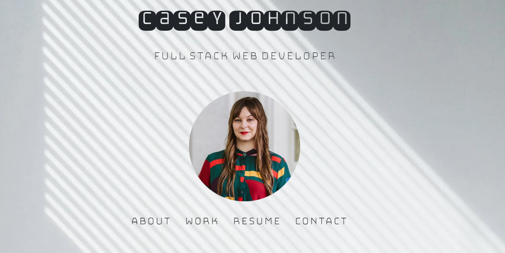
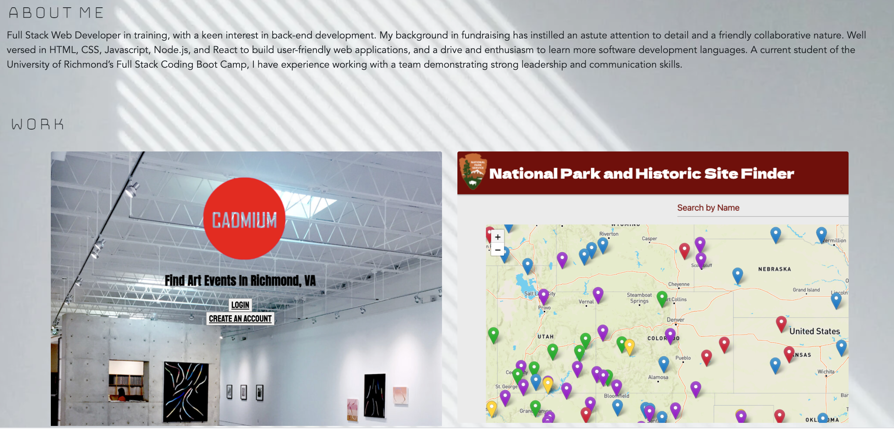

# cmj-portfolio

[Link to Portfolio Website](https://johnsoncm.github.io/cmj-portfolio/) 

**Website Behavior** 
When the links in the navbar are clicked, the user is taken to those sections of the website. When the user clicks the 'Resume' link, they are taken to a pdf of my resume. The project images are linked, as well as the project title. When these links are clicked, the user is taken to the application page in a separate tab. The github repos are also linked.

In the footer, my LinkedIn and Github profiles are linked, as well as my email and phone number.

****
****

**Porfolio Items:** 
[Link to Portfolio Website](https://johnsoncm.github.io/cmj-portfolio/) 
[Link to Resume](https://docs.google.com/document/d/1BXPOifL64DtICmt1H3of6APTad30pTHWIlFAwMLyk9g) 
[Link to LinkedIn Profile](https://www.linkedin.com/in/casey-johnson-11336b4a/) 
[Link to Github Profile](https://github.com/johnsoncm) 

**Technologies Used:** 
HTML 
CSS 
Bootstrap 
Bulma 
Google Fonts 
Font Awesome 

**Contact Info:** 
Casey Johnson 
johnsoncm3@gmail.com 
[Github Profile](https://github.com/johnsoncm) 

